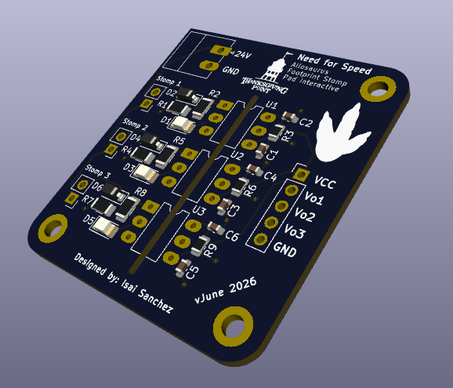

# Allosaurus Footprint Stomp Pad Interactive

Three-channel, optically-isolated 24 V input board plus ESP32 show controller that turns industrial safety mats ("stomp pads") into clean, debounced triggers for synchronized video and LED strip output at the Need for Speed exhibit in Thanksgiving Point's Museum of Ancient Life. A visitor stomps a footprint mat, and the matching dinosaur's clip plays with an accompanying light strip animation around that Allosaurus' femur bone cast.

---

## At a Glance

|                       |                                                                                                 |
| --------------------- | ----------------------------------------------------------------------------------------------- |
| **Input domain**      | 24 V DC current loop, one per mat (field wiring, up to ~10 ft)                                  |
| **Logic domain**      | 3.3 V, shared with the controller (no level shifting needed)                                    |
| **Channels / mats**   | 3 - `hatchling`, `juvenile`, `adult` (one per footprint mat)                                    |
| **Input per channel** | ASOSafety safety mat (normally-open, passive dry contact)                                       |
| **Isolation**         | onsemi **H11L1M** optocoupler - one per channel                                                 |
| **Controller**        | **ESP32-DevKitC** (`fqbn: esp32:esp32:esp32`) firmware sketch in `esp32/`                       |
| **Input logic**       | Mat pressed → `Vo` LOW (**active-low**, external pull-up idles HIGH)                            |
| **Output banks**      | Media (BrightSign) + LED Light Strip (controlled by QuinLED), both **active-low** 200 ms pulses |
| **Show rule**         | First stomp wins; all mats locked out until that clip finishes                                  |
| **PCB**               | `2-layer, JLCPCB fab + assembly`                                                                |
| **Status**            | PCB version June 2026 designed (see `ERRATA.md`) · firmware complete                            |

---



---

## Overview

The Allosaurus Footprint interactive lets visitors stomp on floor-mounted pads to trigger a short video, audio, and light response - a video clip on a BrightSign player and an LED-strip animation on a QuinLED driver - fired in sync from a single step. Each pad is an **industrial normally-open safety mat used here purely as a rugged foot switch** in order to run unattended 24/7 in an abusive museum exhibit environment.

The obvious approach is to wire each mat's dry contact straight into a GPIO with the internal pull-up and debounce in firmware. That may work on a bench, but is not the bullet proof solution on the floor for the following reasons:

- The mats sit **up to ~10 ft** from the controller.
- The exhibit must run **24/7, unattended, for years**, with **hundreds of activations a day** and cannot experience any brown-out or mat trigger failures.
- Hundreds of visitors means hundreds of potential **ESD events** onto the mat wiring.
- Industrial-rated mats need a "wetting" current to ensure reliable long-term operation of the dry contacts (part of the reason manufacturers specify connecting to a 24V system)

A bare high-impedance GPIO sense on a 10 ft run is an antenna prone to noise pickup and false triggers. The optoisolation board I designed was a cheap bulletproof add-on to solves both problems at the input stage, so the controller only ever sees a clean, isolated, logic-level edge - then the firmware does debounce, fault detection, and show sequencing on top.

---

# Hardware

## Hardware Design Requirements

The input board needed to:

- Convert a passive N.O. mat closure into a reliable 3.3 V logic trigger.
- Provide **galvanic isolation** between the 24 V field wiring and the 3.3 V logic, so ground offsets and transients on the mat side cannot reach the MCU.
- Resist false triggers from noise coupled onto the long mat cabling.
- Give maintenance staff a **visible per-channel indicator** to confirm at a glance that a mat is being pressed and its sense path is driven.
- Be manufacturable at JLCPCB (fab + assembly) with clean, auditable part placement and silkscreen labels.
- Run for years with essentially zero maintenance.

These led to a **24 V current loop driving an optocoupler per channel**: the current loop resists noise, adds a bit of "wetting" current, and the optocoupler provides isolation plus a clean Schmitt-trigger output edge for the show controller.

## Main Hardware Components

- onsemi **H11L1M** optocoupler - integrated **Schmitt-trigger, open-collector, logic-compatible** output
- **1N4148W** small-signal diode - reverse-polarity protection across the optocoupler input
- Visible indicator LED (green SMD) - per channel, on the input side
- Current-limiting resistors, pull-up resistors, decoupling/filter capacitors (see **Design Notes**)

The full BOM lives in `manufacturing/`.

## Full Schematic


## Main Hardware Architecture

The three channels are identical.

**Input side (referenced to `GND1`, the 24 V ground):**

```
+24V ── mat (N.O.) ── R_series ── [indicator LED] ── H11L1M IR LED ── GND1
                 └── D2 (1N4148W) across the LED string, reverse protection
```

While someone stands on the mat the contact closes and current flows, driving the H11L1M input IR LED and lighting the visible indicator - so the indicator doubles as direct confirmation the sense LED is driven.

> **Note:** rev 1 places the indicator LED _in series_ with the IR LED. This works but is being revised to a parallel branch - see **Hardware Revisions** and `ERRATA.md`.

**Output side (referenced to `GND2`, the 3.3 V ground):**

```
+3V3 ── R_pullup (2.2 kΩ) ──┬── Vo (H11L1M open-collector) ── ESP32 GPIO
                            └── C1 (0.1 µF) noise filter to GND2
+3V3 ── C2 (0.1 µF) decoupling, close to the H11L1M VCC pin ── GND2
```

The output is **active-low on a press**: pressed → IR LED on → output transistor on → `Vo` LOW. Idle → `Vo` pulled HIGH by the 2.2 kΩ. The output-side `VCC` shares the 3.3 V rail with the MCU so HIGH can never exceed the MCU input rail.

| Mat state        | IR LED | `Vo` node      | GPIO reads | Indicator LED |
| ---------------- | ------ | -------------- | ---------- | ------------- |
| Idle (open)      | off    | HIGH (~3.07 V) | HIGH       | off           |
| Pressed (closed) | on     | LOW (≤ 0.4 V)  | LOW        | lit           |

## Design Notes

### Why a 24 V current loop instead of a bare GPIO

**Current loop, not voltage sense.** Pushing real current (target ~9–10 mA) through the H11L1M input LED is a low-impedance path; noise must overcome actual current to look like a valid change. Far harder to corrupt than a voltage on a high-impedance node over 10 ft.

**Wetting current (bonus).** Meaningful current through the dry mat contacts keeps a **wetting current** flowing, which helps those contacts resist any oxide film that makes aging switches flaky. This sets a _floor_ on the sense-branch current independent of the opto's switching threshold.

### Optocoupler output logic and levels

The H11L1M's integrated Schmitt trigger gives clean, bounce-free edges. Verified against the controller's input thresholds (ESP32 input thresholds are ratios of VDD):

| Parameter                           | Value   | Source                               |
| ----------------------------------- | ------- | ------------------------------------ |
| `V_IH(min)` ≈ 0.75·VDD              | ~2.48 V | ESP32 datasheet                      |
| `V_IL(max)` ≈ 0.25·VDD              | ~0.83 V | ESP32 datasheet                      |
| H11L1M `V_OL`                       | ≤ 0.4 V | datasheet (sinks 16 mA at 0.4 V max) |
| H11L1M output-off leakage `I_OH`    | 100 µA  | datasheet                            |
| H11L1M `V_CC` range (min **3.0 V**) | 3–16 V  | datasheet                            |

With a **2.2 kΩ pull-up**: HIGH ≈ 3.3 − (~105 µA)(2.2 kΩ) ≈ **3.07 V** (~0.6 V over `V_IH`); LOW ≤ **0.4 V** (~0.4 V under `V_IL`); pressed-state sink ≈ 1.3 mA (far below 16 mA). The binding constraint is the HIGH side — the 100 µA leakage droops it — so the pull-up is kept small-ish. `C1` = 0.1 µF with the 2.2 kΩ gives RC ≈ **220 µs**: a **glitch filter, not a debouncer**. Mat bounce runs for milliseconds, so firmware debounce is still mandatory (and the firmware does far more than that - see below).

### Reverse-polarity protection

The 1N4148W spans the forward LED string, reverse-biased in normal use, conducting only on a reversed-polarity miswire. Confirm its orientation (cathode toward +24 V in normal operation). A single series Schottky on the 24 V input is the tidier belt-and-suspenders option if full reverse immunity is ever wanted.

## Hardware Revisions

Two changes are planned for the next board spin. **version June 2026 is functional as-is** - these are improvements, not blockers. Full detail, rationale, and selection guidance live in **[`ERRATA.md`](./ERRATA.md)** next to the rev-1 schematic/PCB files.

- **ERRATA-1: Indicator LED should be parallel, not series.** Version June 2026 shares one loop current between the IR LED and the indicator. Moving the indicator to its own parallel branch (each LED with its own resistor) lets each current be sized independently and stops an open-failed indicator from killing the sense path. **Recompute the opto current when you do**.
- **ERRATA-2: Add a TVS at each mat connector.** Given public foot traffic (ESD) over ~10 ft of exposed cable, 24/7 for years, a unidirectional TVS at each input protects the front-end. (It does _not_ protect the ESP32 - the opto already does that.) Recommended, not required.

## PCB & Manufacturing

**Isolation strategy (the whole point).** `GND1` (24 V) and `GND2` (3.3 V) are separate nets that **never** connect on the board - the only crossing is the opto's light barrier. Two separate bottom-layer copper pours with a ~3 mm gap, the barrier line running through each optocoupler, all three optos oriented identically.

**Mounting holes - verified safe.** The four corner holes carry **no copper** and take plastic standoffs for a custom 3D-printed mount, so hardware can't bridge `GND1` to `GND2`.

**Net classes**

| Class        | Track width | Nets                 |
| ------------ | ----------- | -------------------- |
| `Input_24V`  | 0.5 mm      | `+24V`, `GND1`       |
| `Output_3V3` | 0.3 mm      | `+3V3`, `GND2`, `Vo` |

Both share via 0.6 mm / hole 0.3 mm (0.15 mm annular) and 0.3 mm clearance.

---

# Firmware

`esp32/` — a single non-blocking sketch that reads the three mats, validates each stomp, and fires the matching media + light triggers. No RTOS tasks, no delays; `loop()` runs the whole thing and feeds a hardware watchdog every pass.

## Pinout — `esp32/`

All constants live in `src/Config.h`. Index `i` ties together input `[i]`, media `[i]`, and light `[i]` (mat 1 = hatchling, 2 = juvenile, 3 = adult).

| GPIO     | Direction           | Connects to                         | Constant                |
| -------- | ------------------- | ----------------------------------- | ----------------------- |
| 13       | Input (active-low)  | `Vo1` - hatchling opto output       | `MAT_INPUT_PINS[0]`     |
| 14       | Input (active-low)  | `Vo2` - juvenile opto output        | `MAT_INPUT_PINS[1]`     |
| 15       | Input (active-low)  | `Vo3` - adult opto output           | `MAT_INPUT_PINS[2]`     |
| 21       | Output (active-low) | BrightSign trigger - hatchling clip | `MEDIA_TRIGGER_PINS[0]` |
| 22       | Output (active-low) | BrightSign trigger - juvenile clip  | `MEDIA_TRIGGER_PINS[1]` |
| 23       | Output (active-low) | BrightSign trigger - adult clip     | `MEDIA_TRIGGER_PINS[2]` |
| 16       | Output (active-low) | QuinLED trigger - hatchling strip   | `LIGHT_TRIGGER_PINS[0]` |
| 17       | Output (active-low) | QuinLED trigger - juvenile strip    | `LIGHT_TRIGGER_PINS[1]` |
| 18       | Output (active-low) | QuinLED trigger - adult strip       | `LIGHT_TRIGGER_PINS[2]` |
| 25/26/27 | _reserved_          | former audio bank (WAV Trigger)     | - (do not reuse)        |

## Behavior

**Debounce / validation (per mat).** Three independent timing knobs in `Config.h`, each rejecting a different failure mode — deliberately not collapsed into one value:

| Knob              | Default | Rejects                                                                                 |
| ----------------- | ------- | --------------------------------------------------------------------------------------- |
| `MAT_DEBOUNCE_MS` | 10 ms   | fast edge chatter - line must be stable this long                                       |
| `MAT_MIN_ON_MS`   | 30 ms   | short spikes - press must dwell this long to count (≥ debounce); also the event latency |
| `MAT_REARM_MS`    | 80 ms   | bouncy releases - line must read clear this long to re-arm                              |

**One video at a time (global lockout).** The first validated stomp wins: its clip is triggered and **every** mat input is ignored until that clip finishes, so a video always plays start-to-finish and is never cut off or re-triggered. Lockout = `VIDEO_LENGTH_MS[i]` (13 / 17 / 22 s) + `RETRIGGER_HEADROOM_MS` (1 s) → ~14 / 18 / 23 s. A stomp arriving during a lockout is **discarded**, not queued. This is a different mechanism from `MAT_REARM_MS` (a low-level per-mat cooldown).

**Fail-closed detection.** If a mat reads active continuously for `MAT_STUCK_MS` (10 s - far longer than any real stomp: a welded contact, a stuck mat, or a shorted line), that mat is flagged **faulted**: it stops emitting events and its outputs are forced idle so a stuck input can't leave a device asserted. It auto-recovers after the line reads clear for `MAT_FAULT_RECOVER_MS` (500 ms), re-arming through the boot-safe path.

**Boot-safe.** Each detector starts in `WaitForRelease`, so a mat already held down at power-on never produces a spurious event - it arms only after a confirmed clean release.

**Watchdog.** `loop()` is fully non-blocking and feeds the task watchdog (TWDT) every pass. If anything ever wedges the main task past `WDT_TIMEOUT_MS` (5 s), the watchdog panics and resets the board - the exhibit self-recovers instead of hanging.

## Architecture

The `.ino` handles bring-up (pin setup, watchdog subscribe) and the per-mat loop; the real press logic lives in `src/`.

- **`MatInput`**: a non-blocking, debounced press detector for one active-low opto input, owning only its own state machine (no dependency on Serial or the outputs). `update()` advances it, `eventFired()` latches true exactly once per validated stomp (reading clears it), `pressed()` / `faulted()` / `rawActive()` expose state. The FSM: `WaitForRelease → Armed → PressDebounce → PressConfirm → Held`, with `Faulted` entered from anywhere on a stuck line. Fault and min-on timing are measured against `millis()` marks, so nothing blocks.
- **Main sketch (`esp32.ino`)**: owns one `MatInput` per mat and two output banks (`BANK_MEDIA`, `BANK_LIGHT`) in an index-aligned table, so `triggerMat(i)` fires both of mat `i`'s lines at once and `serviceOutputs()` returns each to idle after the pulse width — non-blocking, so mat scanning never stalls behind an in-flight pulse. It owns the global lockout, logs faults/recoveries once on their edge, and forces a faulted mat's outputs idle. The lockout comparison is rollover-safe (`(int32_t)(now - lockoutUntil) >= 0`).
- **`Config.h`**: single source of truth for pins, polarity, and all timing. `constexpr` throughout (compile-time, zero RAM). Everything you'd tune on the bench lives here so the logic modules stay untouched.

## Deployment & Bring-up

### Flashing

Platform is set in `sketch.yaml` (`esp32:esp32:esp32`). `default_port` is committed as `/dev/cu.usbserial-0001` - **change it to your machine's serial port**, or pass `-p <port>` on upload. A plain `arduino-cli compile` / `upload` builds and flashes the sketch.

### Tuning on the real mat

Leave `SERIAL_LOG_EVENTS = true` and watch the serial console at **115200**. Then:

- **Double-triggers on one stomp** → increase `MAT_DEBOUNCE_MS` (and/or `MAT_REARM_MS`).
- **Missed / dropped stomps** → decrease `MAT_MIN_ON_MS` (keep it ≥ `MAT_DEBOUNCE_MS`).
- Set `VIDEO_LENGTH_MS[]` to the **real** clip durations per mat - these drive the lockout, so a value shorter than the clip will let the exhibit re-arm mid-video.

### What working looks like

| Event             | Serial line                                                                           |
| ----------------- | ------------------------------------------------------------------------------------- |
| Boot              | `Allosaurus Footprint Interactive - ready`                                            |
| Valid stomp       | `Mat N triggered (input GPIO .. -> media .. / light ..); ignoring all mats for .. ms` |
| Stuck mat / short | `FAULT: Mat N stuck active (input GPIO ..) - check for a failed-closed mat/short`     |
| Fault clears      | `RECOVERED: Mat N back to normal (input GPIO ..)`                                     |

### When something is wrong

| Symptom                                            | Likely cause                              | Check                                                                                |
| -------------------------------------------------- | ----------------------------------------- | ------------------------------------------------------------------------------------ |
| A mat never triggers                               | Input wiring / opto / that mat            | Does the on-board indicator LED light on press? Is `Vo` reaching the right GPIO?     |
| A stomp fires media but not lights (or vice-versa) | One output bank's wire                    | That mat's `MEDIA`/`LIGHT` GPIO to the device input, plus common ground              |
| Downstream device never reacts to a pulse          | Polarity / reference mismatch             | Device must trigger on an **active-LOW** pulse and share ground; input must be 3.3 V |
| `FAULT: Mat N stuck active` on repeat              | Welded contact, stuck mat, or shorted run | Inspect that mat and its cable; fault clears itself once the line reads clear        |
| Exhibit ignores stomps for ~15–25 s                | **Not a fault** — global lockout          | A clip is playing; by design all mats are ignored until it ends                      |
| Board reboots every few seconds                    | Watchdog fired — `loop()` stalled         | Something is blocking the main task; check recent changes / peripherals              |

### Quirks worth knowing

- **Simultaneous stomps: first wins.** If two mats are hit close together, only the first registers; the rest are ignored (not queued) until the clip finishes. Intended - one video at a time.
- **A stomp during a video does nothing.** Discarded, not buffered, so the exhibit never "fires late" when the lockout ends.
- **Audio is not wired.** An audio bank (SparkFun + Robertsonics WAV Trigger) was prototyped and removed; GPIO 25/26/27 are reserved. To restore it, re-add `AUDIO_TRIGGER_PINS[] = {25, 26, 27}`, its `static_assert`, and a `BANK_AUDIO` entry in `OUTPUT_BANK_PINS`.

---
